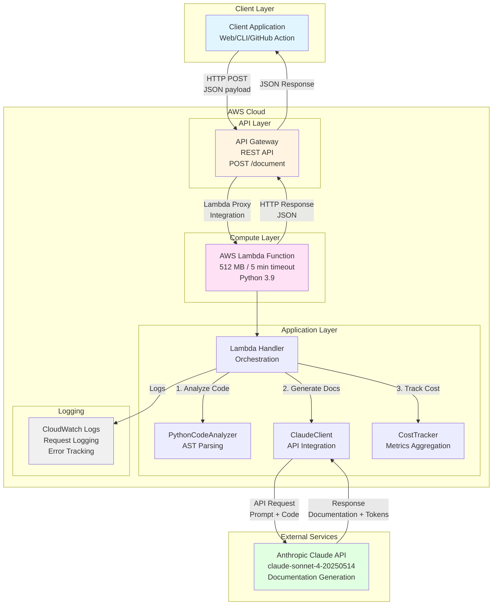
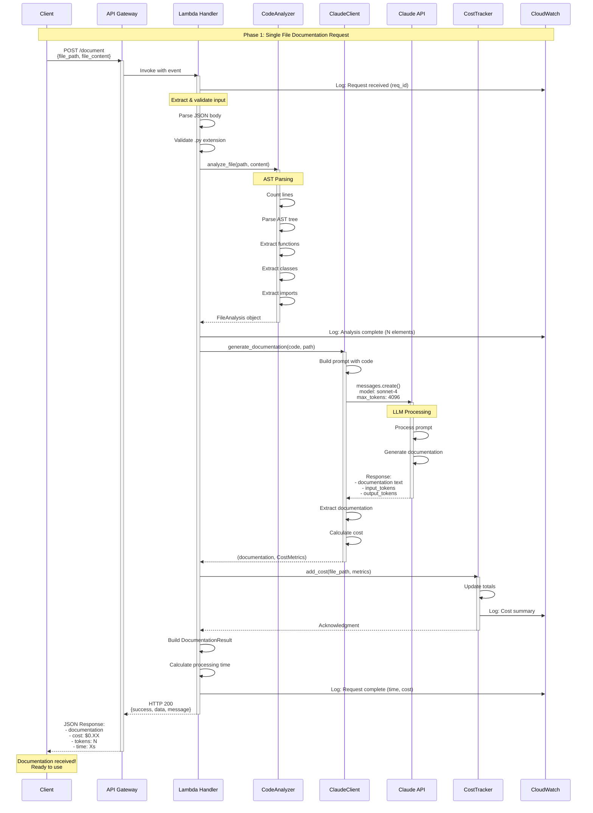
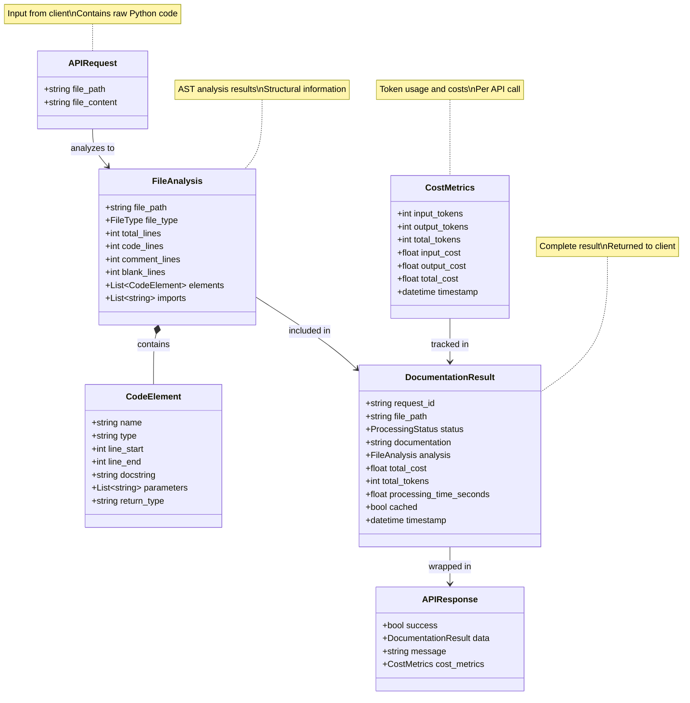
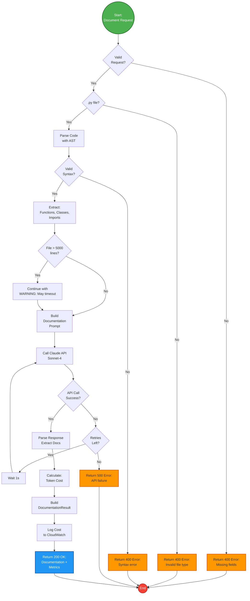

# Phase 1 Architecture - All Diagrams Preview

This file contains all Phase 1 architecture diagrams in one place for easy preview in Cursor.

**How to view:**
1. Install "Markdown Preview Mermaid Support" extension in Cursor
2. Open this file
3. Press `Cmd + Shift + V` (Mac) or `Ctrl + Shift + V` (Windows/Linux)
4. Or press `Cmd + K V` for side-by-side view

---

## 1. System Architecture

**Purpose**: Shows the complete system from client to Claude API with all major components.

**Use when**: Introducing the project, explaining AWS services, discussing infrastructure.

---

## 2. Request Flow (Sequence Diagram)

**Purpose**: Shows the step-by-step sequence of a single documentation request.

**Use when**: Debugging issues, understanding performance bottlenecks, explaining the flow.

---

## 3. Component Flow (Data Pipeline)

**Purpose**: Shows how data transforms through the system from raw code to documentation.

**Use when**: Understanding data transformations, optimizing performance, adding features.

```mermaid
graph LR
    subgraph "Input"
        FileContent[Python Source Code<br/>file_path: str<br/>file_content: str]
    end

    subgraph "Phase 1: Code Analysis"
        Analyzer[PythonCodeAnalyzer]
        AST[AST Parser]
        LineCounter[Line Counter]
        ElementExtractor[Element Extractor]
        
        FileContent --> Analyzer
        Analyzer --> LineCounter
        Analyzer --> AST
        AST --> ElementExtractor
        
        LineCounter --> Analysis
        ElementExtractor --> Analysis
        
        Analysis[FileAnalysis Object<br/>- total_lines<br/>- code_lines<br/>- elements: List<br/>- imports: List]
    end

    subgraph "Phase 2: Documentation Generation"
        PromptBuilder[Prompt Builder]
        APICall[Claude API Call]
        ResponseParser[Response Parser]
        
        Analysis --> PromptBuilder
        FileContent --> PromptBuilder
        PromptBuilder --> APICall
        APICall --> ResponseParser
        
        ResponseParser --> DocResult[Documentation String<br/>+ Token Counts]
    end

    subgraph "Phase 3: Cost Calculation"
        CostCalc[Cost Calculator]
        MetricsAgg[Metrics Aggregator]
        
        DocResult --> CostCalc
        CostCalc --> MetricsAgg
        
        MetricsAgg --> CostMetrics[CostMetrics Object<br/>- input_tokens<br/>- output_tokens<br/>- total_cost: float]
    end

    subgraph "Phase 4: Result Assembly"
        ResultBuilder[Result Builder]
        
        Analysis --> ResultBuilder
        DocResult --> ResultBuilder
        CostMetrics --> ResultBuilder
        
        ResultBuilder --> FinalResult[DocumentationResult<br/>- request_id<br/>- documentation<br/>- analysis<br/>- cost<br/>- time]
    end

    subgraph "Output"
        JSONResponse[JSON Response<br/>HTTP 200]
        
        FinalResult --> JSONResponse
    end

    style FileContent fill:#e3f2fd
    style Analysis fill:#fff3e0
    style DocResult fill:#f3e5f5
    style CostMetrics fill:#e8f5e9
    style FinalResult fill:#fce4ec
    style JSONResponse fill:#e0f2f1
```

---

## 4. Data Model (Class Diagram)

**Purpose**: Shows the data structures and their relationships.

**Use when**: Understanding code structure, adding fields, writing tests.

---

## 5. Decision Flow (Error Handling)

**Purpose**: Shows all decision points and error paths in the system.

**Use when**: Understanding validation, debugging failures, adding error handling.

---

## 6. Phase Comparison (POC vs Production)

**Purpose**: Visual comparison between Phase 1's simplicity and Phase 3's sophistication.

**Use when**: Explaining why Phase 3 matters, motivating students, justifying complexity.

```mermaid
graph TB
    subgraph "Phase 1: Simple POC"
        P1Client[Client] -->|Single File| P1API[API Gateway]
        P1API --> P1Lambda[Lambda<br/>5 min timeout]
        P1Lambda --> P1Analyzer[Code Analyzer]
        P1Lambda --> P1Claude[Claude Client]
        P1Claude -->|Every Request| P1Anthropic[Claude API<br/>$$$$]
        P1Lambda --> P1Cost[Cost Tracker]
        
        style P1Lambda fill:#ffcccc
        style P1Anthropic fill:#ffcccc
    end

    subgraph "Phase 3: Production System"
        P3Client[Client] -->|Batch/Single| P3API[API Gateway]
        P3API --> P3Lambda[Lambda Router<br/>Fast decisions]
        
        P3Lambda --> P3Cache{Cache<br/>Hit?}
        P3Cache -->|Yes| P3Return1[Return<br/>Cached Docs<br/>$0]
        P3Cache -->|No| P3Size{File<br/>Size?}
        
        P3Size -->|Small| P3LambdaProc[Lambda<br/>Processor]
        P3Size -->|Large| P3Queue[SQS Queue]
        P3Queue --> P3ECS[ECS Fargate<br/>Parallel Processing]
        
        P3LambdaProc --> P3Chunk[Chunking<br/>Strategy]
        P3ECS --> P3Chunk
        
        P3Chunk --> P3RateLimit[Rate Limiter<br/>+ Retry Logic]
        P3RateLimit --> P3ClaudeClient[Claude Client]
        P3ClaudeClient --> P3Anthropic[Claude API<br/>$]
        
        P3Anthropic --> P3UpdateCache[Update<br/>DynamoDB Cache]
        P3UpdateCache --> P3S3[Store in S3]
        P3S3 --> P3Return2[Return Docs]
        
        P3Lambda --> P3Monitor[CloudWatch<br/>+ X-Ray]
        
        style P3Cache fill:#ccffcc
        style P3Return1 fill:#ccffcc
        style P3RateLimit fill:#ccffcc
        style P3Chunk fill:#ccffcc
    end

    subgraph "Key Differences"
        D1[❌ No Caching<br/>Every call costs money]
        D2[✅ 80% Cache Hit Rate<br/>Massive cost savings]
        
        D3[❌ No Chunking<br/>Large files timeout]
        D4[✅ Smart Chunking<br/>Handles 50K+ lines]
        
        D5[❌ No Retry Logic<br/>Failures are final]
        D6[✅ Exponential Backoff<br/>Handles rate limits]
        
        D7[❌ Serial Processing<br/>One file at a time]
        D8[✅ Parallel Processing<br/>10x faster on repos]
    end

    style D1 fill:#ffcccc
    style D3 fill:#ffcccc
    style D5 fill:#ffcccc
    style D7 fill:#ffcccc
    
    style D2 fill:#ccffcc
    style D4 fill:#ccffcc
    style D6 fill:#ccffcc
    style D8 fill:#ccffcc
```

---

## Quick Navigation

Jump to:
- [System Architecture](#1-system-architecture) - Big picture overview
- [Request Flow](#2-request-flow-sequence-diagram) - Step-by-step sequence
- [Component Flow](#3-component-flow-data-pipeline) - Data transformations
- [Data Model](#4-data-model-class-diagram) - Class structures
- [Decision Flow](#5-decision-flow-error-handling) - Validation and errors
- [Phase Comparison](#6-phase-comparison-poc-vs-production) - Why Phase 3 matters

## Notes

- All diagrams are rendered with Mermaid
- Colors indicate different layers or states
- Arrows show data flow or dependencies
- Subgraphs group related components

## Exporting

To export any diagram:
1. Right-click on the rendered diagram
2. Select "Copy Image" or use browser tools
3. Paste into presentations, docs, etc.

Or use https://mermaid.live to export as PNG/SVG.
