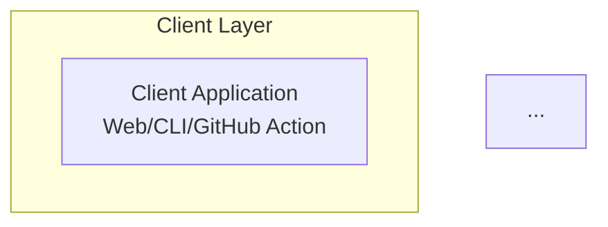
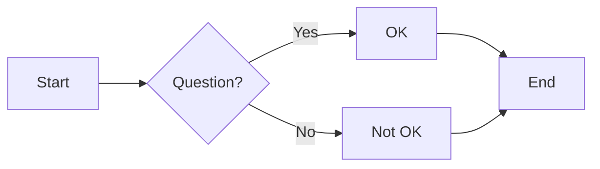

# Setting Up Mermaid Preview in Cursor

## Quick Setup (Recommended)

### Step 1: Install Extension
1. Open Cursor IDE
2. Press `Cmd + Shift + X` (Mac) or `Ctrl + Shift + X` (Windows/Linux)
3. Search for: **"Markdown Preview Mermaid Support"**
4. Click **Install** on the extension by Matt Bierner
5. Reload Cursor if prompted

### Step 2: Create Preview Wrappers
Since your diagrams are in `.mermaid` files, you need to view them in `.md` files.

I've created a script to help, or you can manually create wrappers:

#### Option A: Use the Script
```bash
cd docs/architecture/diagrams
chmod +x preview-diagram.sh
./preview-diagram.sh phase1-system-architecture.mermaid
```

This creates a `temp_preview.md` file that wraps your diagram.

#### Option B: Manual Wrapper
Create a file like `phase1-preview.md`:

```markdown
# Phase 1 Architecture Diagrams

## System Architecture

```

### Step 3: Preview
1. Open any `.md` file with Mermaid diagrams
2. Press `Cmd + Shift + V` (Mac) or `Ctrl + Shift + V` (Windows)
3. Or press `Cmd + K V` for side-by-side view

## Keyboard Shortcuts

| Action | Mac | Windows/Linux |
|--------|-----|---------------|
| Open Preview | `Cmd + Shift + V` | `Ctrl + Shift + V` |
| Preview to Side | `Cmd + K V` | `Ctrl + K V` |
| Toggle Preview | `Cmd + Shift + V` | `Ctrl + Shift + V` |

## Troubleshooting

### Diagrams Not Rendering?

**Problem**: You see the code block instead of the diagram

**Solution**:
1. Make sure the extension is installed and enabled
2. Reload Cursor: `Cmd + Shift + P` → "Reload Window"
3. Check the code fence is exactly: ` ```mermaid ` (not `~~~mermaid`)
4. Ensure there are no syntax errors in your Mermaid code

### Extension Not Found?

**Problem**: Can't find "Markdown Preview Mermaid Support"

**Solution**:
1. Update Cursor to the latest version
2. Try searching for just "Mermaid"
3. Look for the extension by **Matt Bierner** (official)
4. Alternatively, install "Mermaid Preview" which works with `.mermaid` files directly

### Preview Window Blank?

**Problem**: Preview opens but shows nothing

**Solution**:
1. Try the online editor first: https://mermaid.live
2. Paste your diagram code to check for syntax errors
3. Fix any errors, then try preview again in Cursor

## Alternative: Online Preview

If extensions don't work, use the online editor:

1. **Copy** diagram code from your `.mermaid` file
2. **Open** https://mermaid.live
3. **Paste** in the left pane
4. **View** rendered diagram on the right
5. **Export** as PNG/SVG if needed

This is also great for:
- Quick validation
- Sharing with non-technical stakeholders
- Creating images for presentations

## Testing Your Setup

Create a test file: `test-mermaid.md`

```markdown
# Test Mermaid Rendering


```

Open preview with `Cmd + Shift + V`. If you see a flowchart, you're good to go!

## Pro Tips

### Tip 1: Auto-Refresh Preview
The preview auto-refreshes as you type. Keep it open side-by-side while editing.

### Tip 2: Export from Preview
Right-click the diagram in preview → "Copy Image" → Paste into presentations

### Tip 3: Use Live Preview During Development
Keep https://mermaid.live open in a browser tab for instant validation as you code.

### Tip 4: Create a Preview File
Create `ALL-DIAGRAMS.md` that includes all your diagrams in one file for easy navigation:

```markdown
# All Phase 1 Diagrams

## System Architecture
```mermaid
[paste phase1-system-architecture.mermaid content]
```

## Request Flow  
```mermaid
[paste phase1-request-flow.mermaid content]
```

...
```

## Next Steps

Once you have preview working:

1. ✅ Test with the simple test diagram above
2. ✅ Open one of your actual diagrams
3. ✅ Verify it renders correctly
4. ✅ Try side-by-side editing
5. ✅ Export a diagram to PNG for testing

If you encounter any issues, check the troubleshooting section or use the online editor as a fallback.

Happy diagramming! 📊
