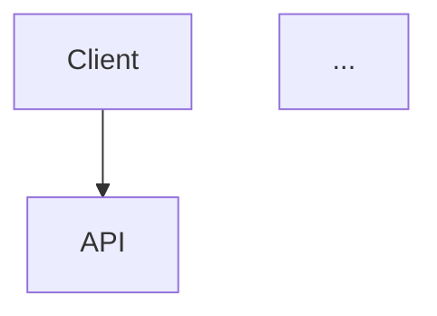

# Phase 1 Architecture Diagrams - Usage Guide

## Quick Reference

| Diagram | Purpose | Best For |
|---------|---------|----------|
| **System Architecture** | Shows all components and their connections | Understanding the big picture |
| **Request Flow** | Shows step-by-step sequence of a single request | Debugging and tracing requests |
| **Component Flow** | Shows data transformation through components | Understanding data processing |
| **Data Model** | Shows data structures and relationships | Understanding the code structure |
| **Decision Flow** | Shows all decision points and error paths | Understanding error handling |
| **Phase Comparison** | Compares Phase 1 vs Phase 3 | Understanding why Phase 3 matters |

## When to Use Each Diagram

### 1. System Architecture (`phase1-system-architecture.mermaid`)

**Use this when:**
- Introducing the project to new team members
- Explaining which AWS services are used and why
- Discussing infrastructure costs
- Planning deployment
- Teaching cloud architecture concepts

**Key Insights:**
- Shows the client-to-API-to-Lambda-to-Claude flow
- Highlights that Phase 1 is surprisingly simple (only 3 AWS services)
- Makes clear that most "work" happens in the Lambda function
- Shows CloudWatch as the only observability tool in Phase 1

**Teaching Points:**
- "Notice how simple this is - just API Gateway and Lambda. No databases, no queues, no caching."
- "The entire application logic lives in one Lambda function. This won't scale, but it's perfect for a POC."
- "CloudWatch is our only visibility into what's happening. No distributed tracing yet."

---

### 2. Request Flow (`phase1-request-flow.mermaid`)

**Use this when:**
- Debugging issues with specific requests
- Understanding performance bottlenecks
- Explaining what happens during a documentation request
- Teaching sequence diagrams
- Code review of the Lambda handler

**Key Insights:**
- Shows the chronological order of operations
- Highlights the synchronous nature (everything waits for Claude API)
- Makes clear where costs are incurred (Claude API call)
- Shows all the logging points

**Teaching Points:**
- "Notice that everything is sequential. The Lambda waits for the analyzer, then waits for Claude, then waits for cost tracking. No parallelism."
- "The Claude API call is the longest step. This is where 90% of the processing time goes."
- "Every log statement corresponds to a CloudWatch log entry you can see in the AWS console."

**Debugging with this diagram:**
- If a request is slow, check if it's stuck in the analyzer (large file?) or Claude API (complex code?)
- If a request fails, trace through the sequence to find where it stopped
- Use the CloudWatch timestamps to correlate with the sequence diagram

---

### 3. Component Flow (`phase1-component-flow.mermaid`)

**Use this when:**
- Understanding data transformations
- Explaining what each component does
- Optimizing for performance or cost
- Adding new features
- Teaching data flow patterns

**Key Insights:**
- Shows how data evolves from raw code to final documentation
- Highlights the four distinct phases: Analysis → Generation → Cost Calc → Assembly
- Makes clear that each phase adds information to the result
- Shows which components depend on which outputs

**Teaching Points:**
- "Data flows left to right through four transformations. Each adds value."
- "The FileAnalysis object is used both for documentation generation AND for the final result. We're not throwing away information."
- "Cost calculation happens separately from documentation generation. This separation makes it easier to test and modify costing logic."

**Optimization opportunities:**
- If analysis is slow, optimize the AST parsing
- If documentation is expensive, optimize the prompt
- If cost calculation is wrong, the bug is in Phase 3 only

---

### 4. Data Model (`phase1-data-model.mermaid`)

**Use this when:**
- Understanding the code structure
- Adding new fields to data models
- Explaining type safety with Pydantic
- Teaching object-oriented design
- Writing tests

**Key Insights:**
- Shows the hierarchical relationship between data structures
- Highlights that FileAnalysis contains multiple CodeElements
- Makes clear that DocumentationResult is the "everything" object
- Shows how APIResponse wraps the result

**Teaching Points:**
- "Notice how CodeElement represents a single function or class, while FileAnalysis contains many CodeElements."
- "The DocumentationResult is a superset. It includes the original analysis PLUS the generated documentation PLUS cost metrics PLUS timing."
- "Pydantic models give us type safety and validation. If a field is required, Pydantic won't let us create an invalid object."

**Code patterns:**
```python
# Creating a CodeElement
element = CodeElement(
    name="add",
    type="function",
    line_start=1,
    line_end=2,
    parameters=["a", "b"]
)

# It's immutable (frozen=True), so this fails:
element.name = "subtract"  # ❌ Error!
```

---

### 5. Decision Flow (`phase1-decision-flow.mermaid`)

**Use this when:**
- Understanding error handling
- Explaining validation logic
- Debugging why requests fail
- Adding new validation rules
- Teaching defensive programming

**Key Insights:**
- Shows every decision point and error path
- Highlights that Phase 1 has minimal retry logic (just once)
- Makes clear where different error codes come from
- Shows the "happy path" vs error paths

**Teaching Points:**
- "The green path is the happy path - everything works perfectly."
- "Orange paths are client errors (400s) - the user sent bad data."
- "The red path is a server error (500) - something went wrong on our side."
- "Notice there's only ONE retry attempt. Production systems retry multiple times with exponential backoff."

**Error scenarios:**
```
Missing fields → 400 (client error)
Wrong file type → 400 (client error)  
Syntax error → 400 (code is invalid)
API timeout → 500 (our problem, should retry more)
```

---

### 6. Phase Comparison (`phase1-vs-phase3-comparison.mermaid`)

**Use this when:**
- Explaining why Phase 3 is necessary
- Justifying the complexity of production systems
- Teaching the value of caching, chunking, retry logic
- Motivating students to complete Phase 3
- Explaining cost optimization

**Key Insights:**
- Shows the stark difference between POC and Production
- Highlights specific features that address Phase 2 problems
- Uses color coding to show what's missing (red) vs what's added (green)
- Makes clear that Phase 3 is not just "more features" but systematic problem-solving

**Teaching Points:**
- "Phase 1 costs ₹4,000 for a 50K line repo. Phase 3 costs ₹240. That's a 94% reduction from caching alone."
- "Phase 1 times out on large files. Phase 3 handles 50K+ lines by chunking intelligently."
- "Phase 1 fails permanently on rate limits. Phase 3 retries with exponential backoff."
- "Phase 1 processes one file at a time. Phase 3 uses ECS for parallel processing."

**Cost comparison table:**
```
Scenario: 50,000 line repository, documented 10 times

Phase 1:
- No caching
- 10 full runs × ₹4,000 = ₹40,000

Phase 3:
- First run: ₹240
- Cached runs (80% hit): ₹48 each
- Total: ₹240 + (9 × ₹48) = ₹672

Savings: ₹39,328 (98% reduction!)
```

---

## How to Present These Diagrams

### For Technical Audiences (Engineers)

Start with the **System Architecture** to show the AWS services and overall structure. Then dive into **Request Flow** to show the exact sequence of operations. Use **Component Flow** to explain data transformations. Reference **Data Model** when discussing code structure.

**Presentation Order:**
1. System Architecture (5 minutes) - "Here's what we're building"
2. Request Flow (10 minutes) - "Here's how it works"
3. Component Flow (5 minutes) - "Here's how data flows"
4. Q&A using other diagrams as needed

### For Non-Technical Audiences (Managers, Stakeholders)

Start with the **Phase Comparison** to show the business value of going from Phase 1 to Phase 3. Use **System Architecture** to explain that Phase 1 is intentionally simple. Skip the detailed diagrams unless asked.

**Presentation Order:**
1. Phase Comparison (10 minutes) - "Here's why Phase 3 matters"
2. System Architecture (5 minutes) - "Here's how simple Phase 1 is"
3. Cost examples (5 minutes) - "Here's the ROI"

### For Students Learning the Project

Start with **System Architecture** for the big picture. Then immediately show **Phase Comparison** to motivate why they'll do Phase 3. Use **Request Flow** when they start coding. Reference **Decision Flow** when they debug errors. Use **Data Model** when they write tests.

**Learning Order:**
1. System Architecture - Day 1
2. Phase Comparison - Day 1
3. Request Flow - Day 2 (while coding)
4. Component Flow - Day 3 (while optimizing)
5. Data Model - Day 3 (while testing)
6. Decision Flow - Day 4 (while debugging)

---

## Diagram Conventions

### Colors

**In System Architecture:**
- Blue = Client/Input
- Orange = API Layer (API Gateway)
- Purple = Compute Layer (Lambda)
- Green = External Services (Claude API)
- Gray = Logging/Monitoring

**In Phase Comparison:**
- Red = Problems/Missing Features
- Green = Solutions/Added Features

**In Decision Flow:**
- Green = Happy path (success)
- Orange = Client errors (400s)
- Red = Server errors (500s)

### Shapes

- **Rectangles** = Components/Services
- **Circles** = Start/End points
- **Diamonds** = Decision points
- **Arrows** = Data flow or call direction

### Annotations

- **Dashed lines** = Optional or conditional flow
- **Thick lines** = High-traffic or critical path
- **Subgraphs** = Logical groupings (layers, phases)

---

## Exporting for Different Uses

### For GitHub README
Copy the `.mermaid` file content directly into your README between triple backticks with the mermaid language identifier:

````markdown

````

### For Presentations (PowerPoint, Google Slides)
1. Open the diagram in https://mermaid.live
2. Click "Export" → "PNG" or "SVG"
3. Insert the image into your presentation
4. Add speaker notes explaining the diagram

### For Documentation Sites (Notion, Confluence)
Most modern documentation platforms support Mermaid directly. Paste the diagram code into a Mermaid block.

### For Printed Materials
Export as high-resolution PNG or SVG, then insert into your document. SVG is preferred for print quality.

---

## Maintaining These Diagrams

### When to Update

Update diagrams when:
- **Architecture changes** → Update System Architecture
- **Flow changes** → Update Request Flow
- **New data fields** → Update Data Model
- **New decision points** → Update Decision Flow
- **New features added** → Update Phase Comparison

### Version Control

Diagrams are text files, so they version control beautifully:
```bash
git diff phase1-system-architecture.mermaid
```

This shows exactly what changed in the architecture.

### Documentation Debt

If you change the code but not the diagrams, you create documentation debt. Set a rule:
- **Code change = Diagram update required**
- **PR must include diagram updates if architecture changes**

---

## Teaching with These Diagrams

### Learning Objectives by Diagram

**System Architecture:**
- LO1: Identify AWS services used in serverless applications
- LO2: Explain the role of API Gateway in REST APIs
- LO3: Understand Lambda function architecture

**Request Flow:**
- LO4: Trace a request through a distributed system
- LO5: Identify synchronous vs asynchronous operations
- LO6: Understand where performance bottlenecks occur

**Component Flow:**
- LO7: Understand data transformation pipelines
- LO8: Identify component responsibilities
- LO9: Recognize coupling between components

**Data Model:**
- LO10: Design type-safe data structures with Pydantic
- LO11: Understand composition vs inheritance
- LO12: Model domain concepts as data classes

**Decision Flow:**
- LO13: Implement defensive programming with validation
- LO14: Distinguish client errors from server errors
- LO15: Understand error handling strategies

**Phase Comparison:**
- LO16: Recognize POC vs Production differences
- LO17: Justify architectural complexity based on requirements
- LO18: Calculate ROI of optimization efforts

### Quiz Questions Based on Diagrams

**From System Architecture:**
- Q: What happens if API Gateway is down?
- Q: Why do we use Lambda instead of EC2?
- Q: Where would you add authentication?

**From Request Flow:**
- Q: What's the slowest step in the flow?
- Q: Where would we add caching?
- Q: Why does Lambda wait for Claude API synchronously?

**From Decision Flow:**
- Q: What HTTP code is returned for invalid file types?
- Q: How many times does Phase 1 retry failed API calls?
- Q: What validation happens before calling Claude?

---

## Summary

These diagrams are not just pretty pictures - they're teaching tools that help you explain complex concepts visually. Use them actively in your teaching, refer to them during code reviews, and update them as the system evolves.

The best diagram is the one that helps someone understand something they didn't before. Choose your diagrams based on your audience and what you're trying to teach.

Remember:
- **Architects** want System Architecture
- **Developers** want Request Flow and Component Flow
- **Testers** want Decision Flow and Data Model
- **Managers** want Phase Comparison
- **Students** want all of them!
