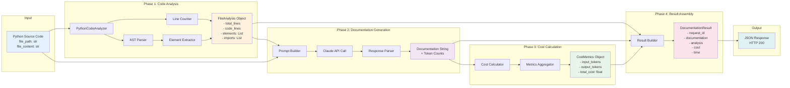

# Mermaid Diagram Preview

```mermaid
graph LR
    subgraph "Input"
        FileContent[Python Source Code<br/>file_path: str<br/>file_content: str]
    end

    subgraph "Phase 1: Code Analysis"
        Analyzer[PythonCodeAnalyzer]
        AST[AST Parser]
        LineCounter[Line Counter]
        ElementExtractor[Element Extractor]
        
        FileContent --> Analyzer
        Analyzer --> LineCounter
        Analyzer --> AST
        AST --> ElementExtractor
        
        LineCounter --> Analysis
        ElementExtractor --> Analysis
        
        Analysis[FileAnalysis Object<br/>- total_lines<br/>- code_lines<br/>- elements: List<br/>- imports: List]
    end

    subgraph "Phase 2: Documentation Generation"
        PromptBuilder[Prompt Builder]
        APICall[Claude API Call]
        ResponseParser[Response Parser]
        
        Analysis --> PromptBuilder
        FileContent --> PromptBuilder
        PromptBuilder --> APICall
        APICall --> ResponseParser
        
        ResponseParser --> DocResult[Documentation String<br/>+ Token Counts]
    end

    subgraph "Phase 3: Cost Calculation"
        CostCalc[Cost Calculator]
        MetricsAgg[Metrics Aggregator]
        
        DocResult --> CostCalc
        CostCalc --> MetricsAgg
        
        MetricsAgg --> CostMetrics[CostMetrics Object<br/>- input_tokens<br/>- output_tokens<br/>- total_cost: float]
    end

    subgraph "Phase 4: Result Assembly"
        ResultBuilder[Result Builder]
        
        Analysis --> ResultBuilder
        DocResult --> ResultBuilder
        CostMetrics --> ResultBuilder
        
        ResultBuilder --> FinalResult[DocumentationResult<br/>- request_id<br/>- documentation<br/>- analysis<br/>- cost<br/>- time]
    end

    subgraph "Output"
        JSONResponse[JSON Response<br/>HTTP 200]
        
        FinalResult --> JSONResponse
    end

    style FileContent fill:#e3f2fd
    style Analysis fill:#fff3e0
    style DocResult fill:#f3e5f5
    style CostMetrics fill:#e8f5e9
    style FinalResult fill:#fce4ec
    style JSONResponse fill:#e0f2f1
```
